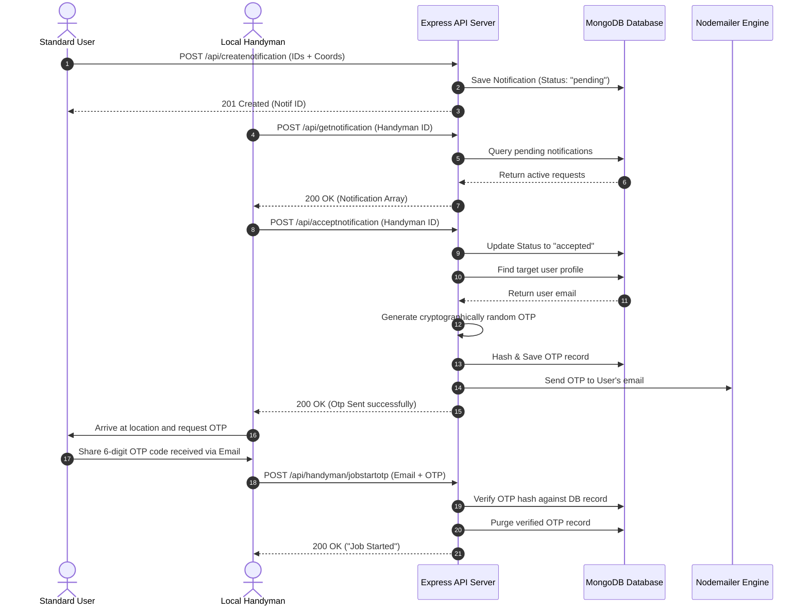
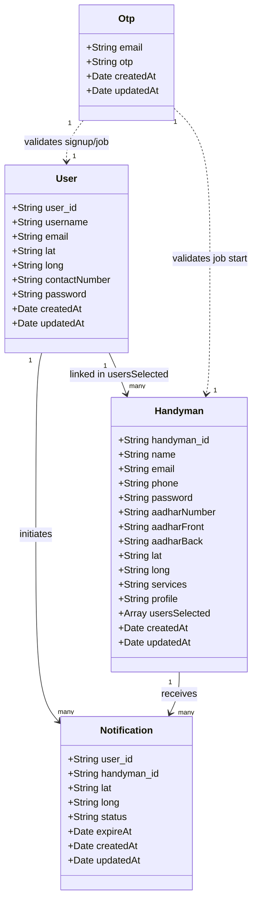

# Low-Level Design (LLD) Document for Local Seva (Local Handyman) Software System

---

## 1. Introduction

### 1.1 Purpose
This document describes the Low-Level Design (LLD) of the **Local Seva (Local Handyman) Software System**. It outlines the internal system architecture, modules, database schema design, class diagrams, API specifications, sequence workflows, and detailed processing logic.

### 1.2 Scope
The Local Seva software platform is designed to connect standard users with local handymen/service providers based on proximity and service categories. The system supports:
* **User Authentication & OTP Verification** (Sign-Up, OTP Verification, Resend OTP, Login)
* **Handyman Authentication & Registration** (Sign-Up with Services, Profile Image, OTP Verification, Login)
* **Location-Based Discovery** (Mapping coordinates via latitude and longitude)
* **Booking & Notification Workflow** (Create Notification, Accept/Reject Request, Auto-expiring Request Statuses)
* **Secure OTP Job Initiation** (Job Start OTP verification between handyman and user)
* **Completed Job Auditing** (Adding users to handyman history upon completion)
* **Payment Integration** (Stripe secure checkout for service bookings, Email receipt/ticket generation)
* **Email Notification System** (Automated OTP delivery, Login confirmation, Event passes via Nodemailer)
* **Image Upload Management** (Hosting media using Cloudinary)

---

## 2. System Architecture

### 2.1 Architecture Overview
The Local Seva system follows a standard **3-Tier Architecture**:

```
+-----------------------------------------------------------+
|                    Presentation Layer                     |
|           - React / Vite Single Page Application          |
|           - Interactive map and profile views             |
+-----------------------------------------------------------+
                              | (HTTPS / JSON)
                              v
+-----------------------------------------------------------+
|                   Business Logic Layer                    |
|           - Node.js & Express API Gateway Server          |
|           - Route routers and controller handlers        |
|           - Middleware validation logic                   |
+-----------------------------------------------------------+
               |                       |              |
               | (Mongoose ODM)        |              |
               v                       v              v
+------------------------+ +-----------------+ +-------------+
|       Data Layer       | | External Mailer | | Payment API |
|   - MongoDB Database   | | - Nodemailer /  | |  - Stripe   |
|   - BSON Collections   | |   Gmail SMTP    | |   Gateway   |
+------------------------+ +-----------------+ +-------------+
```

| Layer | Component | Description |
|---|---|---|
| **Presentation Layer** | React/Vite Client Web App | Interacts with users and handymen, handles frontend state, tracks browser geolocation. |
| **Business Logic Layer**| Express.js Server | Handles routing, business workflows, session tokens, hashing, and email logic. |
| **Data Layer** | MongoDB & Cloud Media | Mongoose ODM stores structured records. Cloudinary manages image files. |

---

## 3. High-Level Components

| Component | Responsibility |
|---|---|
| **Local Seva Client** | Frontend dashboard, location sharing, registration/booking UI. |
| **Express Route Handler** | Directs incoming HTTP requests to corresponding controller modules. |
| **User Controller** | Manages standard user profiles, login, and registration. |
| **Handyman Controller** | Manages handyman services, credentials, and verification assets. |
| **Notification Controller** | Implements the core transaction flow (booking, acceptance, and job verification). |
| **Mail Controller** | Integrates Nodemailer with Gmail SMTP to dispatch verification codes and passes. |
| **Stripe Controller** | Interfaces with Stripe SDK to create secure charges and customer records. |
| **Mongoose Models** | Represents schemas for Users, OTPs, Handymen, and Notifications in MongoDB. |
| **Cloudinary Utility** | Handles profile and verification asset storage in Cloudinary cloud buckets. |

---

## 4. Module Design

### 4.1 Authentication & User Management Module
#### Responsibilities
* Secure account creation for Users and Handymen.
* Generation of cryptographically random 6-digit OTP codes.
* Hashing of passwords and verification codes using `bcrypt`.
* Expiry, verification, and cleaning of OTP records.
* JWT generation used for sessions (`user_id` and `handyman_id`).

#### Classes / Files
* `routes/authRoutes.js`
* `controller/userController.js`
* `controller/handymanController.js`
* `models/model.js` (`User`, `Handyman`, `Otp` schemas)

#### Workflow (User SignUp & Verification)
```
[Client]                [Auth API]               [Otp DB]             [Nodemailer]
   |                        |                       |                       |
   |--- 1. POST /signup --->|                       |                       |
   |    (email)             |--- 2. Delete old ---->|                       |
   |                        |    OTPs for email     |                       |
   |                        |                       |                       |
   |                        |--- 3. Generate OTP -------------------------->|
   |                        |    & Send Email       |                       |   (Sends OTP code)
   |                        |                       |                       |
   |                        |--- 4. Hash & Save --->|                       |
   |                        |    OTP record         |                       |
   |<-- 5. 200 OK ----------|                       |                       |
   |    (OTP Sent)          |                       |                       |
   |                        |                       |                       |
   |--- 6. POST /verify --->|                       |                       |
   |    (email, otp, info)  |--- 7. Fetch OTP ----->|                       |
   |                        |<-- 8. Return OTP -----|                       |
   |                        |                       |                       |
   |                        |-- 9. Bcrypt Compare   |                       |
   |                        |-- 10. Generate JWT    |                       |
   |                        |-- 11. Create User     |                       |
   |                        |-- 12. Purge OTPs ---->|                       |
   |<-- 13. 200 OK ---------|                       |                       |
   |    (Session JWT)       |                       |                       |
```

---

### 4.2 Booking & Notification Module
#### Responsibilities
* Creating service notification requests with proximity coordinates.
* Fetching outstanding requests for specific handymen.
* Handling accept/reject states.
* On acceptance, generating and emailing a **Job Start OTP** to the user.

#### Classes / Files
* `routes/notificationRoutes.js`
* `controller/notificationController.js`
* `models/model.js` (`Notification` schema)

#### Workflow
```
[User Client]          [Notification API]        [Handyman Client]        [Mail API]
      |                        |                         |                    |
      |--- 1. Request service -|                         |                    |
      |    POST /createnotif   |                         |                    |
      |                        |---- 2. Save Pending --->|                    |
      |<-- 3. 201 Created -----|                         |                    |
      |                        |                         |                    |
      |                        |--- 4. Poll/Get notif -->|                    |
      |                        |<-- 5. List requests ----|                    |
      |                        |                         |                    |
      |                        |<-- 6. POST /accept -----|                    |
      |                        |                         |                    |
      |                        |-- 7. Generate Job OTP ---------------------->|
      |                        |-- 8. Save OTP to DB     |                    | (Sends Job Start OTP
      |<-- 9. 200 OK ----------|                                              |  to User Email)
      |    (OTP Sent to user)  |                                              |
```

---

### 4.3 Job Initiation & Complete Module
#### Responsibilities
* Validating the secure Job Start OTP when the handyman arrives.
* Marking the transaction workflow as active.
* Archiving/adding the user to the handyman's history list (`usersSelected`) upon successful service delivery.

#### Classes / Files
* `controller/handymanController.js` (`jobStartOtpVerify`)
* `controller/notificationController.js` (`workDoneCheck`)

---

### 4.4 Payment Integration Module
#### Responsibilities
* Creating a Stripe customer profile.
* Processing charges securely in Indian Rupees (INR).
* Generating confirmation event passes / tickets and emailing them post-payment.

#### Classes / Files
* `routes/paymentRoutes.js`
* `controller/stripeController.js`
* `controller/mailController.js` (`sendTicket`)

---

### 4.5 Mail & OTP Module
#### Responsibilities
* Configuring the Gmail SMTP connection.
* Asynchronously dispatching emails (Sign-up validation, Job initiation code, login receipts, payment ticket pass).

#### Classes / Files
* `controller/mailController.js`

---

## 5. Database Design

### 5.1 Tables (Mongoose Collections)

#### 1. USER Collection (`user`)
Stores basic contact and geographic coordinate details for standard booking accounts.

| Field Name | Type | Key | Description |
|---|---|---|---|
| `_id` | ObjectId | Primary | Internal MongoDB identifier |
| `user_id` | String | Unique | JWT security token acting as session id |
| `username` | String | - | User display name (trimmed) |
| `email` | String | Unique | Login email address (lowercase, trimmed) |
| `lat` | String | - | Latitude coordinate for service dispatch |
| `long` | String | - | Longitude coordinate for service dispatch |
| `contactNumber`| String | - | Main contact telephone number |
| `password` | String | - | Hashed account password |
| `createdAt` | Date | - | Document creation timestamp |
| `updatedAt` | Date | - | Last update timestamp |

#### 2. OTP Collection (`otp`)
Temporary storage for signup and job-start transaction validation codes.

| Field Name | Type | Key | Description |
|---|---|---|---|
| `_id` | ObjectId | Primary | Internal MongoDB identifier |
| `email` | String | - | Email address to which OTP was sent |
| `otp` | String | - | Hashed 6-digit OTP verification code |
| `createdAt` | Date | - | Document creation timestamp |
| `updatedAt` | Date | - | Last update timestamp |

#### 3. HANDYMAN Collection (`handyman`)
Stores professional details, services offered, coordinates, and complete verification statuses.

| Field Name | Type | Key | Description |
|---|---|---|---|
| `_id` | ObjectId | Primary | Internal MongoDB identifier |
| `handyman_id` | String | - | JWT security token acting as session id |
| `name` | String | - | Handyman display name |
| `email` | String | Unique | Communication and login email |
| `phone` | String | - | Telephone contact number |
| `password` | String | - | Hashed account password |
| `aadharNumber`| String | - | Aadhar identification number for verification |
| `aadharFront` | String | - | URL link to front of Aadhar card in Cloudinary |
| `aadharBack` | String | - | URL link to back of Aadhar card in Cloudinary |
| `lat` | String | - | Proximity latitude coordinate |
| `long` | String | - | Proximity longitude coordinate |
| `services` | String | - | Service classification tag (e.g. Plumbing) |
| `profile` | String | - | Profile photo storage link |
| `usersSelected`| Array | - | History record containing users successfully serviced |
| `createdAt` | Date | - | Document creation timestamp |
| `updatedAt` | Date | - | Last update timestamp |

#### 4. NOTIFICATION Collection (`notification`)
Logs direct booking requests between users and handymen. Uses Mongoose index properties to automatically expire documents.

| Field Name | Type | Key | Description |
|---|---|---|---|
| `_id` | ObjectId | Primary | Internal MongoDB identifier |
| `user_id` | String | Ref: `User` | ID of requesting customer |
| `handyman_id` | String | Ref: `Handyman`| Target service provider |
| `lat` | String | - | User dispatch latitude |
| `long` | String | - | User dispatch longitude |
| `status` | String | Enum | Proximity status: `["pending", "accepted", "rejected"]` |
| `expireAt` | Date | Index | Timestamp set to expire 20 seconds after creation |
| `createdAt` | Date | - | Document creation timestamp |
| `updatedAt` | Date | - | Last update timestamp |

---

## 6. API Design

### 6.1 Authentication & Verification API
#### 6.1.1 Initiate User Sign-Up
* **Endpoint**: `POST /api/user/signup`
* **Request**:
  ```json
  {
    "email": "user@example.com"
  }
  ```
* **Response (Success)**:
  ```json
  {
    "msg": "Otp sent successfully!"
  }
  ```

#### 6.1.2 Verify User OTP & Create Account
* **Endpoint**: `POST /api/user/signup/verify`
* **Request**:
  ```json
  {
    "email": "user@example.com",
    "otp": "123456",
    "username": "johndoe",
    "password": "hashedPasswordExample",
    "contactNumber": "+919876543210",
    "lat": "22.7196",
    "long": "75.8577"
  }
  ```
* **Response (Success)**:
  ```json
  {
    "msg": "Account creation successful!",
    "user_id": "jwt_session_token"
  }
  ```

#### 6.1.3 User Login
* **Endpoint**: `POST /api/user/login`
* **Request**:
  ```json
  {
    "email": "user@example.com",
    "password": "plainPassword"
  }
  ```
* **Response (Success)**:
  ```json
  {
    "msg": "Log-In successful!",
    "user_id": "jwt_session_token"
  }
  ```

---

### 6.2 Service & Notification API

#### 6.2.1 Create Service Notification Request
* **Endpoint**: `POST /api/createnotification`
* **Request**:
  ```json
  {
    "user_id": "jwt_user_token",
    "handyman_id": "jwt_handyman_token",
    "lat": "22.7196",
    "long": "75.8577"
  }
  ```
* **Response (Success - 201 Created)**:
  ```json
  {
    "user_id": "jwt_user_token",
    "handyman_id": "jwt_handyman_token",
    "lat": "22.7196",
    "long": "75.8577",
    "status": "pending",
    "_id": "6459384784a0d927dca018c1",
    "expireAt": "2026-05-26T18:11:00Z"
  }
  ```

#### 6.2.2 Accept Request
* **Endpoint**: `POST /api/acceptnotification`
* **Request**:
  ```json
  {
    "handyman_id": "jwt_handyman_token"
  }
  ```
* **Response (Success)**:
  ```json
  {
    "msg": "Otp sent successfully!"
  }
  ```

---

### 6.3 Payment API
#### 6.3.1 Process Stripe Booking Payment
* **Endpoint**: `POST /api/config`
* **Request**:
  ```json
  {
    "product": {
      "name": "Ac repair",
      "price": 350
    },
    "token": {
      "email": "user@example.com",
      "id": "tok_visa",
      "billing_name": "John Doe",
      "shipping_address_line1": "Flat 304, Green Heights",
      "shipping_address_city": "Indore",
      "shipping_address_country": "India",
      "shipping_address_zip": "452001"
    }
  }
  ```
* **Response (Success)**:
  ```json
  {
    "status": "success"
  }
  ```

---

## 7. Collaboration Diagram

Below is the sequence flow for a standard Handyman booking request:



---

## 8. Class / Schema Model Diagram

This class diagram represents the core Mongoose schemas and relationships:



---

## 9. Error Handling Design

| Error Code | HTTP Status | Description |
|---|---|---|
| **SEVA_400** | `400 Bad Request` | General validation error (invalid parameter syntax). |
| **SEVA_OTP_EXPIRED** | `400 Bad Request` | Provided OTP has expired or doesn't exist in database. |
| **SEVA_OTP_MISMATCH**| `400 Bad Request` | OTP digits input by handyman do not match db hash. |
| **SEVA_DUP_EMAIL** | `400 Bad Request` | Registration email already linked to active account. |
| **SEVA_AUTH_FAILED** | `401 Unauthorized` | Invalid password validation mismatch. |
| **SEVA_NOT_FOUND** | `404 Not Found` | Requested User/Handyman/Notification ID not found. |
| **SEVA_SERVER_ERR** | `500 Server Error` | Database connection error or system script exception. |

---

## 10. Security Design

* **Password Security**: Standard passwords are never stored in plain text. They are hashed using a randomized salt with `bcrypt.hash(password, 10)`.
* **OTP Verification Integrity**: Job start and signup OTP codes are cryptographically generated, hashed using `bcrypt` on the database, and deleted immediately upon matching verification.
* **JSON Web Tokens (JWT)**: Security sessions use signed JWT tokens (configured with `JWT_SECRET`) which reside inside the user's `user_id` and `handyman_id` fields for API request authentication.
* **Transit Security**: Communication between presentation layer and express backend is configured to use secure HTTPS web sockets.
* **Auto-Expiring Sessions**: Inactive notification booking requests expire automatically from the MongoDB engine after 20 seconds using TTL (Time to Live) database indexing properties.

---

## 11. Logging & Monitoring

* **Console Logging**: Application logs trace database startup status (`Server is running on...`), connection exceptions, notification insertions, and mail dispatch tracking statuses.
* **TTL Indexes**: Automated database pruning cleans expired OTP validation entries and outdated notification logs.

---

## 12. Performance Requirements

| Parameter | Value |
|---|---|
| **API Response Time** | < 2 seconds for lookup operations under normal load. |
| **Mail Dispatch Time** | OTP delivery to user inbox < 5 seconds. |
| **Database Query Efficiency**| B-tree indexing on unique variables (`email`, `user_id`, `expireAt`). |
| **System Availability** | 99.9% uptime with reliable horizontal MongoDB connection clustering. |

---

## 13. System & External Interfaces

* **Nodemailer / SMTP Interface**: External connection with Gmail API service using `NODE_MAILER_USER` and `NODE_MAILER_PASS` credential tokens to dispatch notification updates.
* **Stripe Interface**: Rest API integration with `STRIPE_KEY` to process INR payments safely.
* **Cloudinary Interface**: Media CDN interface to store, upload, and serve Handyman profile photos and verification cards (Aadhar).
* **HTML5 Geolocation API**: The frontend accesses hardware-based latitude and longitude metrics from the client browser to feed coordinates into distance algorithms.

---

## 14. Assumptions

1. Client browsers support HTML5 Geolocation API sharing and have permission settings enabled.
2. The server host maintains high network accessibility with external service providers (Gmail SMTP, Stripe, Cloudinary).
3. The email inputs registered during account creation are active.

---

## 15. Future Enhancements

* **WebSocket Support**: Real-time bidding updates and coordinates movement tracking using Socket.io instead of polling query intervals.
* **Rating & Feedback Systems**: Allowing customers to grade handymen upon completing service tasks.
* **Multi-Service Catalog**: Expanding categorizations to custom subsets (Electricians, Cleaners, Packers).
* **Admin Dashboard UI**: A control console to verify Aadhar card uploads and unlock/block accounts.
* **Interactive Chat**: Built-in messaging between client and handyman prior to arrival.

---

## 16. Conclusion

This Low-Level Design (LLD) document establishes the comprehensive structure, schemas, flow routines, and integrations driving the Local Seva system. It provides clear technical blueprints for engineers to construct, verify, and expand the platform features going forward.
